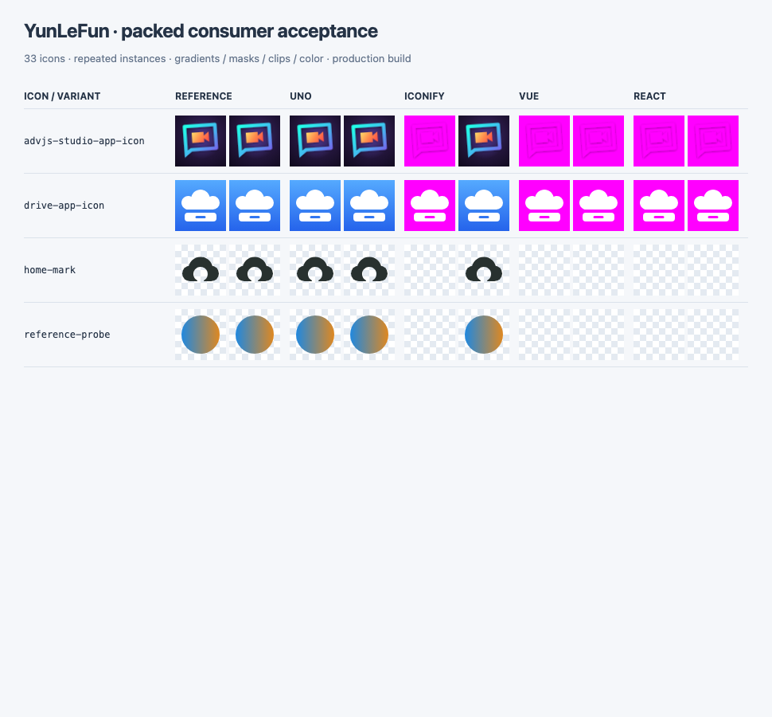
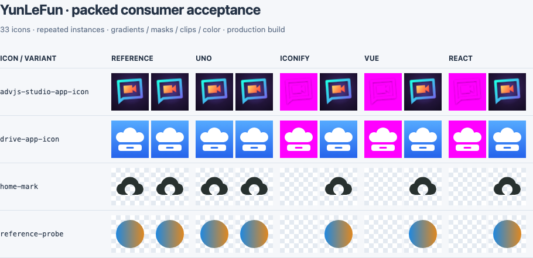

# 2026-10-05 消费者验收证据

本次在 Node 24.18.0、pnpm 11.20.0、Playwright 1.63.0 的 Chromium 上运行。安装对象为本地生成的 `@yunlefun/icons@0.3.1` tarball；没有发布版本。

- `pnpm release:preflight`：通过（37 项单测及 build / lint / typecheck / docs:build / pack:check / consumer:check）。
- 全部 33 枚图标通过 UnoCSS 和 Iconify Vue 渲染；8 枚代表图标验证 Vue SFC 与 React TSX，另有一个未发布的裁剪/href 探针。
- 172 次同次运行的参考图比较全部通过，最大差异像素比例为 0.3663%，低于 1% 门限。
- 同名实例与跨框架实例没有重复 ID，片段引用都指向自身 SVG；修改首个实例后，第二个实例的像素差异为零。
- 所有图标有可见像素，全部 mark 保留透明像素，全部 app-icon 为不透明完整方形画布；挂载后修改 CSS color 也通过。
- 四个单图标生产构建都通过模块、体积和实际浏览器渲染检查。

## 修复前后

每个单元格有两个实例。测试把左侧实例的渐变改为洋红色，并隐藏它的遮罩/裁剪图形。**右侧实例应保持原样**。参考图与 UnoCSS 是隔离的图片，不受 DOM 定义修改影响。

修复前，Vue / React 的同名 ID 互相污染；渐变一起变色，遮罩/裁剪实例一起消失：

修复后，使用框架 useId 给定义和引用绑定实例 ID，右侧实例保持原样：

[查看所有图标的五列对比](./all-icons.png)。`go-far-away-mark` 保留原图混合配色；UnoCSS 的单色 mask 行为在该行和验收说明中明确标注，其他三个组件路径保留蓝绿细节与 currentColor 主体。

## 按需构建

以下为同一 `brand-mark` 样例的未 gzip 产物字节数，框架运行时计入总大小，图标自身单独统计：

| 路径 | 总 JS + CSS | 图标模块 | 结果 |
| --- | ---: | ---: | --- |
| UnoCSS | 731 B | 0 B JS | 仅一条图标 CSS，CSS 约 0.60 KB |
| Iconify Vue | 77,653 B | 446 B | 仅 `icons/brand-mark.json` |
| Vue SFC | 59,865 B | 1,373 B | 仅 `YlfBrandMark.vue` |
| React TSX | 219,354 B | 938 B | 仅 `YlfBrandMark.tsx` |

修复前使用包根 `icons.icons['brand-mark']` 的 Iconify 构建约 136.62 KB，其中图标包模块仍有 61,464 B；改为单图标入口后图标模块只有 446 B。全量 `addCollection` 继续作为明确需要完整集合的接口。

另外修复了文档 SVG 导出路径：带扩展名的 `svg/brand-mark.svg` 不再被映射为 `brand-mark.svg.svg`，验收遍历全部图标检查两种导入形式。

这些截图是本次修复的证据快照。最新可复核的逐项结果和模块清单由 `pnpm consumer:check` 写入 `.artifacts/consumer/results/report.json` 与 `bundles.json`，不会自动改写本目录中的历史证据。
